```mermaid
sequenceDiagram
    participant A as App
    participant G as Google
    participant B as Backend
    participant DB as Database
    
    A->>G: Iniciar OAuth Google
    G-->>A: Google OAuth token
    A->>B: POST /auth/google (token)
    B->>G: Validar token con Google API
    G-->>B: Datos usuario válidos
    B->>B: Verificar email @tecsup.edu.pe
    B->>DB: Buscar/crear usuario
    B->>B: Asignar contraseña temporal segura
    B->>B: Generar JWT token
    B-->>A: AuthResponse + JWT token
```

```mermaid
sequenceDiagram
    participant A as App
    participant B as Backend
    participant DB as Database
    
    A->>B: POST /user/setup-password
    B->>B: Validar JWT token
    B->>DB: Obtener usuario actual
    B->>B: Verificar tiene contraseña temporal Google
    B->>B: Validar nueva contraseña
    B->>B: Encriptar nueva contraseña
    B->>DB: Reemplazar contraseña temporal
    B-->>A: Confirmación de configuración
```

```mermaid
sequenceDiagram
    participant A as App
    participant B as Backend
    participant DB as Database
    
    A->>B: GET /aulas (+ JWT token)
    B->>B: Validar JWT token
    B->>DB: Consultar todas las aulas
    B->>DB: Incluir información de equipamiento
    DB-->>B: Lista completa de aulas
    B-->>A: Array de AulaVirtualResponse
```

```mermaid
sequenceDiagram
    participant A as App
    participant B as Backend
    participant DB as Database
    
    A->>B: GET /reservas/mis-reservas (parámetros)
    B->>B: Validar JWT token
    B->>B: Extraer profesorId del token
    B->>DB: Consultar reservas del profesor
    B->>DB: Aplicar filtros y paginación
    B->>DB: Incluir datos de aula y curso
    DB-->>B: Lista paginada de reservas
    B-->>A: Respuesta con reservas y metadatos
```

```mermaid
sequenceDiagram
    participant A as App
    participant B as Backend
    participant DB as Database
    
    A->>B: GET /calendario/fechas-bloqueadas
    B->>B: Validar JWT token
    B->>B: Obtener fecha actual (zona Lima)
    B->>DB: Consultar bloqueos desde hoy hasta +1 año
    B->>DB: Incluir bloqueos globales y específicos por aula
    DB-->>B: Lista de fechas bloqueadas
    B-->>A: Array de bloqueos con detalles
```

```mermaid
sequenceDiagram
    participant A as App
    participant B as Backend
    
    A->>B: GET /calendario/horario-funcionamiento
    B->>B: Validar JWT token
    B->>B: Obtener configuración de horarios
    B-->>A: Información de horarios y restricciones
```

# 📚 Documentación de API - Sistema de Reservas de Aulas Virtuales TECSUP

## 🚀 Introducción

Esta documentación te guiará paso a paso para integrar tu aplicación móvil Kotlin con nuestro backend de Spring Boot. El sistema permite gestionar reservas de aulas virtuales para profesores de TECSUP de manera segura y eficiente.

## 🏗️ Arquitectura del Sistema

```
┌─────────────────┐    HTTP/REST     ┌─────────────────┐
│   App Kotlin    │ ◄─────────────► │  Spring Boot    │
│   (Cliente)     │                 │   Backend       │
└─────────────────┘                 └─────────────────┘
                                             │
                                             ▼
                                    ┌─────────────────┐
                                    │    │
                                    │   Database      │
                                    └─────────────────┘
```

### Flujo Principal de Autenticación


## 🔐 Base URL y Configuración

```
Base URL: http://localhost:8080/api
Headers requeridos: 
- Content-Type: application/json
- Authorization: Bearer {jwt_token} (para endpoints protegidos)
```

---

## 📋 Endpoints de Autenticación

### 1. 🔑 Iniciar Sesión

**Endpoint:** `POST /auth/signin`

**Descripción:** Autentica un usuario y devuelve un token JWT para futuras peticiones.

**Flujo de Uso:**


**Request Body:**
```json
{
    "email": "profesor@tecsup.edu.pe",
    "password": "miPassword123"
}
```

**Validaciones:**
- ✅ Email debe terminar en `@tecsup.edu.pe`
- ✅ Email no puede estar vacío
- ✅ Password no puede estar vacío
- ✅ Usuario debe estar activo

**Response Exitoso (200):**
```json
{
    "message": "Login exitoso",
    "type": "Bearer",
    "token": "jwt_token_example_here_do_not_use_in_production",
    "userInfo": {
        "id": 1,
        "profesorId": 10,
        "username": "profesor@tecsup.edu.pe",
        "email": "profesor@tecsup.edu.pe",
        "firstName": "Juan",
        "lastName": "Pérez"
    }
}
```

**Errores Posibles:**

**400 - Bad Request:**
```json
{
    "error": "Email requerido",
    "message": "El email es obligatorio",
    "field": "email"
}
```

**401 - Unauthorized:**
```json
{
    "error": "Credenciales incorrectas",
    "message": "Email o contraseña inválidos"
}
```

**403 - Forbidden:**
```json
{
    "error": "Dominio no permitido",
    "message": "Solo se permiten correos de TECSUP",
    "field": "email"
}
```

**Caso Especial - Usuario Google sin contraseña configurada:**
```json
{
    "error": "Configuración pendiente",
    "message": "Este usuario ingresó con Google y debe configurar su contraseña",
    "requirePassword": true
}
```

### 2. 📝 Registrar Usuario

**Endpoint:** `POST /auth/signup`

**Descripción:** Registra un nuevo profesor en el sistema (solo emails @tecsup.edu.pe).

**Flujo de Uso:**


**Request Body:**
```json
{
    "email": "nuevo.profesor@tecsup.edu.pe",
    "password": "password123",
    "firstName": "María",
    "lastName": "García"
}
```

**Validaciones:**
- ✅ Email debe ser único en el sistema
- ✅ Email debe terminar en `@tecsup.edu.pe`
- ✅ Password mínimo 6 caracteres
- ✅ firstName y lastName obligatorios
- ✅ Formato de email válido

**Response Exitoso (200):**
```json
{
    "message": "Usuario registrado exitosamente",
    "type": "Bearer",
    "token": "jwt_token_example_here_do_not_use_in_production",
    "userInfo": {
        "id": 2,
        "profesorId": 11,
        "username": "nuevo.profesor@tecsup.edu.pe",
        "email": "nuevo.profesor@tecsup.edu.pe",
        "firstName": "María",
        "lastName": "García"
    }
}
```

**Errores Posibles:**

**400 - Datos inválidos:**
```json
{
    "error": "Email en uso",
    "message": "El email ya está registrado",
    "field": "email"
}
```

**400 - Password inválido:**
```json
{
    "error": "Password inválido",
    "message": "La contraseña debe tener al menos 6 caracteres",
    "field": "password"
}
```

**403 - Dominio no permitido:**
```json
{
    "error": "Dominio no permitido",
    "message": "Solo se permiten correos de TECSUP",
    "field": "email"
}
```

### 3. 🔑 Autenticación con Google

**Endpoint:** `POST /auth/google`

**Descripción:** Autentica usando Google OAuth (para usuarios @tecsup.edu.pe).

**Flujo de Uso:**


**Request Body:**
```json
{
    "token": "google_oauth_token_example_here_do_not_use_in_production",
    "email": "carlos.ramirez@tecsup.edu.pe"
}
```

**Response Exitoso (200):**
```json
{
    "message": "Autenticación Google exitosa",
    "type": "Bearer",
    "token": "jwt_token_example_here_do_not_use_in_production",
    "userInfo": {
        "id": 3,
        "profesorId": 12,
        "username": "carlos.ramirez@tecsup.edu.pe",
        "email": "carlos.ramirez@tecsup.edu.pe",
        "firstName": "Carlos",
        "lastName": "Ramírez"
    },
    "requirePasswordSetup": true
}
```

**Errores Posibles:**

**401 - Token inválido:**
```json
{
    "error": "Token inválido",
    "message": "Token de Google expirado o inválido"
}
```

**403 - Dominio no permitido:**
```json
{
    "error": "Dominio no permitido",
    "message": "Solo se permiten correos @tecsup.edu.pe",
    "receivedEmail": "usuario@gmail.com"
}
```

---

## 🔑 Endpoints de Gestión de Contraseñas

### 1. 🔄 Cambiar Contraseña

**Endpoint:** `PUT /user/password`

**Descripción:** Permite a un usuario cambiar su contraseña actual por una nueva.

**Headers Requeridos:** 
```
Authorization: Bearer {jwt_token}
Content-Type: application/json
```

**Flujo de Uso:**


**Request Body:**
```json
{
    "currentPassword": "miPasswordActual123",
    "newPassword": "miNuevaPassword456"
}
```

**Validaciones:**
- ✅ currentPassword debe coincidir con la almacenada
- ✅ newPassword mínimo 6 caracteres, máximo 128
- ✅ newPassword no puede ser igual a contraseñas comunes
- ✅ Usuario debe estar autenticado

**Response Exitoso (200):**
```json
{
    "success": true,
    "message": "Contraseña cambiada exitosamente",
    "data": null
}
```

**Errores Posibles:**

**400 - Contraseña actual incorrecta:**
```json
{
    "success": false,
    "message": "Contraseña actual incorrecta"
}
```

**400 - Nueva contraseña inválida:**
```json
{
    "success": false,
    "message": "La contraseña debe tener al menos 6 caracteres"
}
```

### 2. ⚙️ Configurar Contraseña (Google OAuth)

**Endpoint:** `POST /user/setup-password`

**Descripción:** Permite a usuarios que ingresaron con Google OAuth configurar su primera contraseña.

**Headers Requeridos:** 
```
Authorization: Bearer {jwt_token}
Content-Type: application/json
```

**Flujo de Uso:**


**Request Body:**
```json
{
    "password": "miNuevaPassword123",
    "googleToken": "optional_google_token_for_verification"
}
```

**Response Exitoso (200):**
```json
{
    "success": true,
    "message": "Contraseña configurada exitosamente",
    "data": null
}
```

**Errores Posibles:**

**400 - Usuario ya tiene contraseña:**
```json
{
    "success": false,
    "message": "Este usuario ya tiene una contraseña configurada. Use el endpoint de cambio de contraseña."
}
```

---

## 👤 Endpoints de Perfil

### 1. 📋 Obtener Perfil

**Endpoint:** `GET /perfil`

**Descripción:** Obtiene la información completa del perfil del usuario autenticado.

**Headers Requeridos:** 
```
Authorization: Bearer {jwt_token}
Content-Type: application/json
```

**Flujo de Uso:**


**Response Exitoso (200):**
```json
{
    "success": true,
    "message": "Perfil obtenido correctamente",
    "data": {
        "userId": 1,
        "profesorId": 10,
        "email": "profesor@tecsup.edu.pe",
        "firstName": "Juan",
        "lastName": "Pérez",
        "telefono": "+51987654321",
        "ubicacion": "Lima, Perú",
        "biografia": "Profesor de Ingeniería de Software con 10 años de experiencia",
        "departamento": "Ingeniería de Sistemas",
        "carrera": "Ingeniería de Software",
        "cursos": ["Programación Móvil", "Base de Datos", "Estructuras de Datos"],
        "imagenPerfil": "http://localhost:8080/uploads/user_1/profile/profile_123.jpg",
        "fechaActualizacion": "2024-01-15T10:30:00",
        "fechaCreacion": "2023-03-20T08:15:00",
        "estado": "ACTIVO"
    }
}
```

**Errores Posibles:**

**401 - Token inválido:**
```json
{
    "success": false,
    "message": "Token JWT inválido o expirado"
}
```

**404 - Perfil no encontrado:**
```json
{
    "success": false,
    "message": "Perfil de usuario no encontrado"
}
```

### 2. ✏️ Actualizar Perfil

**Endpoint:** `PUT /perfil`

**Descripción:** Actualiza la información del perfil del usuario autenticado.

**Headers Requeridos:** 
```
Authorization: Bearer {jwt_token}
Content-Type: application/json
```

**Flujo de Uso:**


**Request Body:**
```json
{
    "telefono": "+51987654321",
    "ubicacion": "Lima, Perú",
    "biografia": "Profesor especializado en desarrollo móvil con experiencia en Android y iOS",
    "departamentoId": 1,
    "carreraId": 2
}
```

**Validaciones:**
- ✅ Teléfono: formato válido (opcional)
- ✅ Ubicación: máximo 255 caracteres (opcional)
- ✅ Biografía: máximo 1000 caracteres (opcional)
- ✅ departamentoId: debe existir en BD (opcional)
- ✅ carreraId: debe existir en BD (opcional)

**Response Exitoso (200):**
```json
{
    "success": true,
    "message": "Perfil actualizado correctamente",
    "data": {
        "userId": 1,
        "profesorId": 10,
        "email": "profesor@tecsup.edu.pe",
        "firstName": "Juan",
        "lastName": "Pérez",
        "telefono": "+51987654321",
        "ubicacion": "Lima, Perú",
        "biografia": "Profesor especializado en desarrollo móvil con experiencia en Android y iOS",
        "departamento": "Ingeniería de Sistemas",
        "carrera": "Ingeniería de Software",
        "imagenPerfil": "http://localhost:8080/uploads/user_1/profile/profile_123.jpg",
        "fechaActualizacion": "2024-06-24T14:30:00"
    }
}
```

### 3. 📷 Sincronizar Imagen de Perfil con Google

**Endpoint:** `POST /perfil/imagen/sincronizar`

**Descripción:** Sincroniza automáticamente la imagen de perfil desde Google (para usuarios OAuth).

**Headers Requeridos:** 
```
Authorization: Bearer {jwt_token}
```

**Flujo de Uso:**


**Response Exitoso (200):**
```json
{
    "success": true,
    "message": "Imagen de perfil sincronizada correctamente",
    "data": {
        "imagenUrl": "http://localhost:8080/uploads/user_1/profile/profile_1719240000.jpg",
        "imagenOriginal": "https://lh3.googleusercontent.com/a/original_google_image_url",
        "fechaSincronizacion": "2024-06-24T14:30:00",
        "tamaño": "150KB",
        "formato": "JPEG"
    }
}
```

### 4. 🏢 Obtener Departamentos

**Endpoint:** `GET /perfil/departamentos`

**Descripción:** Obtiene la lista de todos los departamentos académicos disponibles.

**Response Exitoso (200):**
```json
{
    "success": true,
    "message": "Departamentos obtenidos",
    "data": [
        {
            "id": 1,
            "nombre": "Ingeniería de Sistemas",
            "codigo": "IS",
            "descripcion": "Departamento de Ingeniería de Sistemas y Computación"
        },
        {
            "id": 2,
            "nombre": "Ingeniería Industrial",
            "codigo": "II",
            "descripcion": "Departamento de Ingeniería Industrial"
        },
        {
            "id": 3,
            "nombre": "Administración",
            "codigo": "ADM",
            "descripcion": "Departamento de Administración y Negocios"
        }
    ]
}
```

### 5. 🎓 Obtener Carreras

**Endpoint:** `GET /perfil/carreras`

**Descripción:** Obtiene la lista de todas las carreras disponibles.

**Response Exitoso (200):**
```json
{
    "success": true,
    "message": "Carreras obtenidas",
    "data": [
        {
            "id": 1,
            "nombre": "Ingeniería de Software",
            "codigo": "ISOFT",
            "departamentoId": 1,
            "departamentoNombre": "Ingeniería de Sistemas",
            "duracion": "6 semestres"
        },
        {
            "id": 2,
            "nombre": "Redes y Comunicaciones",
            "codigo": "REDES",
            "departamentoId": 1,
            "departamentoNombre": "Ingeniería de Sistemas",
            "duracion": "6 semestres"
        }
    ]
}
```

### 6. 📚 Obtener Carreras por Departamento

**Endpoint:** `GET /perfil/carreras/departamento/{departamentoId}`

**Descripción:** Obtiene las carreras que pertenecen a un departamento específico.

**Parámetros de URL:**
- `departamentoId` (Long): ID del departamento

**Ejemplo de Uso:**
```
GET /perfil/carreras/departamento/1
```

**Response Exitoso (200):**
```json
{
    "success": true,
    "message": "Carreras obtenidas por departamento",
    "data": [
        {
            "id": 1,
            "nombre": "Ingeniería de Software",
            "codigo": "ISOFT",
            "departamentoId": 1,
            "departamentoNombre": "Ingeniería de Sistemas"
        },
        {
            "id": 2,
            "nombre": "Redes y Comunicaciones",
            "codigo": "REDES",
            "departamentoId": 1,
            "departamentoNombre": "Ingeniería de Sistemas"
        }
    ]
}
```

### 7. 📖 Obtener Cursos por Carrera

**Endpoint:** `GET /perfil/cursos/carrera/{carreraId}`

**Descripción:** Obtiene los cursos que pertenecen a una carrera específica.

**Parámetros de URL:**
- `carreraId` (Long): ID de la carrera

**Response Exitoso (200):**
```json
{
    "success": true,
    "message": "Cursos obtenidos por carrera",
    "data": [
        {
            "id": 1,
            "nombre": "Programación Móvil",
            "codigo": "PROG-MOV",
            "carreraId": 1,
            "carreraNombre": "Ingeniería de Software",
            "ciclo": 5,
            "creditos": 4,
            "horasTeoria": 2,
            "horasPractica": 4
        },
        {
            "id": 2,
            "nombre": "Base de Datos",
            "codigo": "BD",
            "carreraId": 1,
            "carreraNombre": "Ingeniería de Software",
            "ciclo": 3,
            "creditos": 4,
            "horasTeoria": 3,
            "horasPractica": 2
        }
    ]
}
```

### 8. 📚 Obtener Cursos por Múltiples Carreras

**Endpoint:** `POST /perfil/cursos/carreras`

**Descripción:** Obtiene cursos de múltiples carreras en una sola consulta.

**Request Body:**
```json
[1, 2, 3]
```

**Response Exitoso (200):**
```json
{
    "success": true,
    "message": "Cursos obtenidos por carreras",
    "data": [
        {
            "id": 1,
            "nombre": "Programación Móvil",
            "codigo": "PROG-MOV",
            "carreraId": 1,
            "carreraNombre": "Ingeniería de Software"
        },
        {
            "id": 5,
            "nombre": "Redes de Computadoras",
            "codigo": "REDES-COMP",
            "carreraId": 2,
            "carreraNombre": "Redes y Comunicaciones"
        }
    ]
}
```

---

## 🏢 Endpoints de Aulas Virtuales

### 1. 📋 Listar Todas las Aulas

**Endpoint:** `GET /aulas`

**Descripción:** Obtiene la lista completa de todas las aulas virtuales registradas en el sistema.

**Headers Requeridos:** 
```
Authorization: Bearer {jwt_token}
Content-Type: application/json
```

**Flujo de Uso:**


**Response Exitoso (200):**
```json
[
    {
        "id": 1,
        "codigo": "AV001",
        "nombre": "Aula Virtual Sistemas 1",
        "descripcion": "Aula equipada con proyector 4K y sistema de audio avanzado",
        "capacidad": 30,
        "ubicacion": "Edificio A - Piso 2",
        "estado": "DISPONIBLE",
        "equipamiento": ["Proyector 4K", "Sistema de audio", "Pizarra digital", "WiFi alta velocidad"],
        "disponible": true,
        "fechaCreacion": "2024-01-15T08:30:00",
        "ultimaActualizacion": "2024-06-20T14:15:00"
    },
    {
        "id": 2,
        "codigo": "AV002", 
        "nombre": "Aula Virtual Sistemas 2",
        "descripcion": "Aula moderna con equipamiento completo para clases magistrales",
        "capacidad": 40,
        "ubicacion": "Edificio A - Piso 3",
        "estado": "DISPONIBLE",
        "equipamiento": ["Proyector HD", "Micrófono inalámbrico", "Pizarra digital"],
        "disponible": true,
        "fechaCreacion": "2024-02-10T09:00:00",
        "ultimaActualizacion": "2024-06-18T11:30:00"
    }
]
```

**Errores Posibles:**

**401 - Token inválido:**
```json
{
    "error": "Token inválido",
    "message": "Token de autorización requerido o expirado"
}
```

**500 - Error interno:**
```json
{
    "error": "Error interno del servidor",
    "message": "Error al obtener la lista de aulas"
}
```

### 2. ✅ Listar Aulas Disponibles

**Endpoint:** `GET /aulas/disponibles`

**Descripción:** Obtiene solo las aulas que están marcadas como disponibles para reservas.

**Headers Requeridos:** 
```
Authorization: Bearer {jwt_token}
Content-Type: application/json
```

**Flujo de Uso:**


**Response Exitoso (200):**
```json
[
    {
        "id": 1,
        "codigo": "AV001",
        "nombre": "Aula Virtual Sistemas 1",
        "descripcion": "Aula equipada con proyector 4K",
        "capacidad": 30,
        "ubicacion": "Edificio A - Piso 2",
        "estado": "DISPONIBLE",
        "equipamiento": ["Proyector 4K", "Sistema de audio", "Pizarra digital"],
        "disponible": true,
        "proximaReserva": null
    }
]
```

### 3. 🔍 Filtrar Aulas con Criterios Específicos

**Endpoint:** `POST /aulas/disponibles/filtros`

**Descripción:** Busca aulas disponibles aplicando filtros específicos como fecha, hora y capacidad.

**Headers Requeridos:** 
```
Authorization: Bearer {jwt_token}
Content-Type: application/json
```

**Flujo de Uso:**


**Request Body:**
```json
{
    "fecha": "2024-07-15",
    "horaInicio": "09:00",
    "horaFin": "11:00",
    "capacidadMinima": 25,
    "equipamientoRequerido": ["Proyector", "Sistema de audio"],
    "ubicacion": "Edificio A"
}
```

**Validaciones:**
- ✅ fecha: formato YYYY-MM-DD, no puede ser pasada
- ✅ horaInicio/horaFin: formato HH:mm, horario válido (08:00-22:00)
- ✅ capacidadMinima: número entero positivo
- ✅ equipamientoRequerido: array opcional de strings
- ✅ ubicacion: string opcional

**Response Exitoso (200):**
```json
[
    {
        "id": 1,
        "codigo": "AV001",
        "nombre": "Aula Virtual Sistemas 1",
        "descripcion": "Aula equipada con proyector 4K",
        "capacidad": 30,
        "ubicacion": "Edificio A - Piso 2",
        "estado": "DISPONIBLE",
        "equipamiento": ["Proyector 4K", "Sistema de audio", "Pizarra digital"],
        "disponible": true,
        "coincidenciaEquipamiento": 100,
        "horarioLibre": true
    }
]
```

**Errores Posibles:**

**400 - Criterios inválidos:**
```json
{
    "error": "Criterios inválidos",
    "message": "La fecha no puede ser anterior a hoy",
    "field": "fecha"
}
```

### 4. 🔍 Obtener Aula por ID

**Endpoint:** `GET /aulas/{id}`

**Descripción:** Obtiene información detallada de un aula específica por su ID.

**Headers Requeridos:** 
```
Authorization: Bearer {jwt_token}
Content-Type: application/json
```

**Parámetros de Ruta:**
- `id` (Long): ID único del aula virtual

**Response Exitoso (200):**
```json
{
    "id": 1,
    "codigo": "AV001",
    "nombre": "Aula Virtual Sistemas 1",
    "descripcion": "Aula equipada con proyector 4K y sistema de audio avanzado",
    "capacidad": 30,
    "ubicacion": "Edificio A - Piso 2",
    "estado": "DISPONIBLE",
    "equipamiento": ["Proyector 4K", "Sistema de audio", "Pizarra digital", "WiFi alta velocidad"],
    "disponible": true,
    "fechaCreacion": "2024-01-15T08:30:00",
    "ultimaActualizacion": "2024-06-20T14:15:00",
    "reservasHoy": 2,
    "proximaReserva": {
        "fecha": "2024-06-25",
        "horaInicio": "14:00",
        "profesor": "María García"
    }
}
```

**Errores Posibles:**

**404 - Aula no encontrada:**
```json
{
    "error": "Aula no encontrada",
    "message": "No existe un aula con el ID especificado"
}
```

### 5. ➕ Crear Nueva Aula (Administradores)

**Endpoint:** `POST /aulas`

**Descripción:** Crea una nueva aula virtual en el sistema (requiere permisos de administrador).

**Headers Requeridos:** 
```
Authorization: Bearer {jwt_token}
Content-Type: application/json
```

**Request Body:**
```json
{
    "codigo": "AV003",
    "nombre": "Aula Virtual Sistemas 3",
    "descripcion": "Nueva aula con equipamiento de última generación",
    "capacidad": 35,
    "ubicacion": "Edificio B - Piso 1",
    "estado": "DISPONIBLE",
    "equipamiento": ["Proyector 4K", "Sistema de audio", "Pizarra digital", "Cámara HD"]
}
```

**Validaciones:**
- ✅ codigo: único en el sistema, formato alfanumérico
- ✅ nombre: mínimo 3 caracteres, máximo 100
- ✅ capacidad: número entero entre 10 y 100
- ✅ estado: valores permitidos (DISPONIBLE, MANTENIMIENTO, FUERA_DE_SERVICIO)
- ✅ equipamiento: array de strings válidos

**Response Exitoso (201):**
```json
{
    "id": 3,
    "codigo": "AV003",
    "nombre": "Aula Virtual Sistemas 3",
    "descripcion": "Nueva aula con equipamiento de última generación",
    "capacidad": 35,
    "ubicacion": "Edificio B - Piso 1",
    "estado": "DISPONIBLE",
    "equipamiento": ["Proyector 4K", "Sistema de audio", "Pizarra digital", "Cámara HD"],
    "disponible": true,
    "fechaCreacion": "2024-06-24T15:30:00"
}
```

**Errores Posibles:**

**409 - Código duplicado:**
```json
{
    "error": "Código en uso",
    "message": "Ya existe un aula con el código especificado",
    "field": "codigo"
}
```

### 6. ✏️ Actualizar Aula Existente (Administradores)

**Endpoint:** `PUT /aulas/{codigo}`

**Descripción:** Actualiza la información de un aula existente (requiere permisos de administrador).

**Headers Requeridos:** 
```
Authorization: Bearer {jwt_token}
Content-Type: application/json
```

**Parámetros de Ruta:**
- `codigo` (String): Código único del aula virtual

**Request Body:**
```json
{
    "nombre": "Aula Virtual Sistemas 1 - Actualizada",
    "descripcion": "Aula con equipamiento renovado",
    "capacidad": 32,
    "ubicacion": "Edificio A - Piso 2",
    "estado": "DISPONIBLE",
    "equipamiento": ["Proyector 4K", "Sistema de audio", "Pizarra digital", "WiFi mejorado"]
}
```

### 7. 🗑️ Eliminar Aula (Administradores)

**Endpoint:** `DELETE /aulas/{codigo}`

**Descripción:** Elimina un aula del sistema (solo si no tiene reservas activas).

**Headers Requeridos:** 
```
Authorization: Bearer {jwt_token}
```

**Parámetros de Ruta:**
- `codigo` (String): Código único del aula virtual

**Response Exitoso (200):**
```json
{
    "message": "Aula eliminada exitosamente",
    "codigo": "AV003"
}
```

**Errores Posibles:**

**409 - No se puede eliminar:**
```json
{
    "error": "No se puede eliminar",
    "message": "El aula tiene reservas activas o futuras"
}
```

---

## 📅 Endpoints de Reservas

### 1. ➕ Crear Nueva Reserva

**Endpoint:** `POST /reservas`

**Descripción:** Crea una nueva reserva de aula virtual para el profesor autenticado.

**Headers Requeridos:** 
```
Authorization: Bearer {jwt_token}
Content-Type: application/json
```

**Flujo de Uso:**


**Request Body:**
```json
{
    "aulaVirtualId": 1,
    "fecha": "2024-07-15",
    "horaInicio": "09:00",
    "horaFin": "11:00",
    "motivo": "Clase de Programación Móvil - Módulo Android",
    "cursoId": 5,
    "observaciones": "Se requiere configurar el proyector para presentaciones. Grupo de 25 estudiantes."
}
```

**Validaciones:**
- ✅ aulaVirtualId: debe existir y estar disponible
- ✅ fecha: formato YYYY-MM-DD, no puede ser anterior a hoy
- ✅ horaInicio/horaFin: formato HH:mm, dentro del horario permitido (08:00-22:00)
- ✅ Duración: mínimo 45 minutos, máximo 4 horas
- ✅ motivo: mínimo 10 caracteres, máximo 255
- ✅ No puede haber conflictos con otras reservas
- ✅ Fecha no puede estar bloqueada en el calendario

**Response Exitoso (201):**
```json
{
    "success": true,
    "message": "Reserva creada exitosamente",
    "data": {
        "id": 100,
        "aulaVirtual": {
            "id": 1,
            "codigo": "AV001",
            "nombre": "Aula Virtual Sistemas 1",
            "ubicacion": "Edificio A - Piso 2",
            "capacidad": 30
        },
        "profesor": {
            "id": 10,
            "nombre": "Juan Pérez",
            "email": "profesor@tecsup.edu.pe"
        },
        "fecha": "2024-07-15",
        "horaInicio": "09:00:00",
        "horaFin": "11:00:00",
        "motivo": "Clase de Programación Móvil - Módulo Android",
        "curso": {
            "id": 5,
            "nombre": "Programación Móvil",
            "codigo": "PM001"
        },
        "observaciones": "Se requiere configurar el proyector para presentaciones. Grupo de 25 estudiantes.",
        "estado": "CONFIRMADA",
        "fechaCreacion": "2024-06-24T14:30:00",
        "codigoReserva": "RES-2024-000100"
    }
}
```

**Errores Posibles:**

**400 - Datos inválidos:**
```json
{
    "success": false,
    "message": "La fecha no puede ser anterior a hoy",
    "field": "fecha"
}
```

**409 - Conflicto de horario:**
```json
{
    "success": false,
    "message": "El aula ya está reservada en ese horario",
    "conflicto": {
        "reservaExistente": "RES-2024-000095",
        "horario": "09:00-10:30"
    }
}
```

**400 - Fecha bloqueada:**
```json
{
    "success": false,
    "message": "No se pueden hacer reservas en esta fecha",
    "motivo": "Mantenimiento programado de aulas"
}
```

### 2. 📋 Listar Mis Reservas

**Endpoint:** `GET /reservas/mis-reservas`

**Descripción:** Obtiene todas las reservas del profesor autenticado con paginación y filtros.

**Headers Requeridos:** 
```
Authorization: Bearer {jwt_token}
```

**Query Parameters:**
- `page` (opcional): Número de página (default: 0)
- `size` (opcional): Elementos por página (default: 10, máximo: 50)
- `estado` (opcional): PENDIENTE, CONFIRMADA, CANCELADA, COMPLETADA
- `fechaDesde` (opcional): Filtrar desde fecha (YYYY-MM-DD)
- `fechaHasta` (opcional): Filtrar hasta fecha (YYYY-MM-DD)
- `aulaId` (opcional): Filtrar por aula específica

**Flujo de Uso:**


**Response Exitoso (200):**
```json
{
    "success": true,
    "message": "Reservas obtenidas correctamente",
    "data": {
        "content": [
            {
                "id": 100,
                "aulaVirtual": {
                    "id": 1,
                    "codigo": "AV001",
                    "nombre": "Aula Virtual Sistemas 1",
                    "ubicacion": "Edificio A - Piso 2"
                },
                "fecha": "2024-07-15",
                "horaInicio": "09:00:00",
                "horaFin": "11:00:00",
                "motivo": "Clase de Programación Móvil",
                "curso": {
                    "id": 5,
                    "nombre": "Programación Móvil"
                },
                "estado": "CONFIRMADA",
                "fechaCreacion": "2024-06-24T14:30:00",
                "codigoReserva": "RES-2024-000100",
                "puedeModificar": true,
                "puedeCancel": true
            }
        ],
        "pageable": {
            "page": 0,
            "size": 10,
            "totalElements": 15,
            "totalPages": 2
        }
    }
}
```

### 3. 🔍 Obtener Reserva por ID

**Endpoint:** `GET /reservas/{id}`

**Descripción:** Obtiene información detallada de una reserva específica.

**Headers Requeridos:** 
```
Authorization: Bearer {jwt_token}
```

**Parámetros de Ruta:**
- `id` (Long): ID único de la reserva

**Response Exitoso (200):**
```json
{
    "success": true,
    "message": "Reserva obtenida correctamente",
    "data": {
        "id": 100,
        "aulaVirtual": {
            "id": 1,
            "codigo": "AV001",
            "nombre": "Aula Virtual Sistemas 1",
            "ubicacion": "Edificio A - Piso 2",
            "capacidad": 30,
            "equipamiento": ["Proyector 4K", "Sistema de audio"]
        },
        "profesor": {
            "id": 10,
            "nombre": "Juan Pérez",
            "email": "profesor@tecsup.edu.pe"
        },
        "fecha": "2024-07-15",
        "horaInicio": "09:00:00",
        "horaFin": "11:00:00",
        "motivo": "Clase de Programación Móvil - Módulo Android",
        "curso": {
            "id": 5,
            "nombre": "Programación Móvil",
            "codigo": "PM001"
        },
        "observaciones": "Se requiere configurar el proyector para presentaciones",
        "estado": "CONFIRMADA",
        "fechaCreacion": "2024-06-24T14:30:00",
        "fechaActualizacion": "2024-06-24T14:30:00",
        "codigoReserva": "RES-2024-000100",
        "puedeModificar": true,
        "puedeCancel": true,
        "horasAntes": 48
    }
}
```

### 4. ✏️ Modificar Reserva

**Endpoint:** `PUT /reservas/{id}`

**Descripción:** Modifica una reserva existente (solo si faltan más de 24 horas).

**Headers Requeridos:** 
```
Authorization: Bearer {jwt_token}
Content-Type: application/json
```

**Parámetros de Ruta:**
- `id` (Long): ID único de la reserva

**Request Body:**
```json
{
    "fecha": "2024-07-16",
    "horaInicio": "10:00",
    "horaFin": "12:00",
    "motivo": "Clase de Programación Móvil - Módulo Android (Modificada)",
    "observaciones": "Cambio de horario por disponibilidad de laboratorio"
}
```

**Validaciones:**
- ✅ Solo el profesor propietario puede modificar
- ✅ Debe faltar más de 24 horas para la reserva
- ✅ Nuevo horario debe estar disponible
- ✅ Validaciones similares a creación de reserva

### 5. ❌ Cancelar Reserva

**Endpoint:** `DELETE /reservas/{id}/cancelar`

**Descripción:** Cancela una reserva existente proporcionando un motivo.

**Headers Requeridos:** 
```
Authorization: Bearer {jwt_token}
Content-Type: application/json
```

**Parámetros de Ruta:**
- `id` (Long): ID único de la reserva

**Flujo de Uso:**


**Request Body:**
```json
{
    "motivo": "Cambio de horario de clase por feriado no programado"
}
```

**Validaciones:**
- ✅ Solo el profesor propietario puede cancelar
- ✅ Reserva debe estar en estado CONFIRMADA
- ✅ motivo: mínimo 10 caracteres, máximo 255

**Response Exitoso (200):**
```json
{
    "success": true,
    "message": "Reserva cancelada exitosamente",
    "data": {
        "id": 100,
        "codigoReserva": "RES-2024-000100",
        "estado": "CANCELADA",
        "fechaCancelacion": "2024-06-24T16:45:00",
        "motivoCancelacion": "Cambio de horario de clase por feriado no programado"
    }
}
```

**Errores Posibles:**

**403 - No autorizado:**
```json
{
    "success": false,
    "message": "No tienes permisos para cancelar esta reserva"
}
```

**409 - No se puede cancelar:**
```json
{
    "success": false,
    "message": "No se puede cancelar una reserva que ya comenzó"
}
```

### 6. 📊 Verificar Disponibilidad de Aula

**Endpoint:** `GET /reservas/disponibilidad`

**Descripción:** Verifica si un aula está disponible en una fecha y horario específicos.

**Headers Requeridos:** 
```
Authorization: Bearer {jwt_token}
```

**Query Parameters (Todos Obligatorios):**
- `aulaId` (Long): ID del aula virtual
- `fecha` (String): Fecha en formato YYYY-MM-DD
- `horaInicio` (String): Hora de inicio en formato HH:mm
- `horaFin` (String): Hora de fin en formato HH:mm
- `excluirReservaId` (opcional): ID de reserva a excluir (para modificaciones)

**Flujo de Uso:**


**Response Exitoso (200):**
```json
{
    "success": true,
    "message": "Verificación de disponibilidad completada",
    "data": {
        "disponible": true,
        "aula": {
            "id": 1,
            "codigo": "AV001",
            "nombre": "Aula Virtual Sistemas 1"
        },
        "fecha": "2024-07-15",
        "horaInicio": "09:00",
        "horaFin": "11:00",
        "conflictos": [],
        "fechaBloqueada": false,
        "aulaDisponible": true
    }
}
```

**Response con Conflictos (200):**
```json
{
    "success": true,
    "message": "Verificación de disponibilidad completada",
    "data": {
        "disponible": false,
        "aula": {
            "id": 1,
            "codigo": "AV001",
            "nombre": "Aula Virtual Sistemas 1"
        },
        "fecha": "2024-07-15",
        "horaInicio": "09:00",
        "horaFin": "11:00",
        "conflictos": [
            {
                "reservaId": 95,
                "horaInicio": "08:30",
                "horaFin": "10:30",
                "profesor": "María García",
                "motivo": "Clase de Base de Datos"
            }
        ],
        "fechaBloqueada": false,
        "aulaDisponible": true,
        "sugerencias": [
            {
                "horaInicio": "10:30",
                "horaFin": "12:30"
            },
            {
                "horaInicio": "14:00",
                "horaFin": "16:00"
            }
        ]
    }
}
```

### 7. 📈 Estadísticas de Mis Reservas

**Endpoint:** `GET /reservas/estadisticas`

**Descripción:** Obtiene estadísticas de uso de las reservas del profesor autenticado.

**Headers Requeridos:** 
```
Authorization: Bearer {jwt_token}
```

**Query Parameters:**
- `periodo` (opcional): SEMANAL, MENSUAL, TRIMESTRAL (default: MENSUAL)
- `fechaDesde` (opcional): Fecha inicio del período (YYYY-MM-DD)
- `fechaHasta` (opcional): Fecha fin del período (YYYY-MM-DD)

**Response Exitoso (200):**
```json
{
    "success": true,
    "message": "Estadísticas obtenidas correctamente",
    "data": {
        "periodo": "MENSUAL",
        "fechaDesde": "2024-06-01",
        "fechaHasta": "2024-06-30",
        "totalReservas": 12,
        "reservasConfirmadas": 10,
        "reservasCanceladas": 2,
        "horasTotales": 24.5,
        "aulasMasUsadas": [
            {
                "aulaId": 1,
                "codigo": "AV001",
                "nombre": "Aula Virtual Sistemas 1",
                "vecesUsada": 6
            }
        ],
        "horariosMasFrecuentes": [
            {
                "horaInicio": "09:00",
                "frecuencia": 4
            },
            {
                "horaInicio": "14:00",
                "frecuencia": 3
            }
        ],
        "cursosConMasReservas": [
            {
                "cursoId": 5,
                "nombre": "Programación Móvil",
                "reservas": 8
            }
        ]
    }
}
```

---

## 📅 Endpoints de Calendario

### 1. 🚫 Obtener Fechas Bloqueadas

**Endpoint:** `GET /calendario/fechas-bloqueadas`

**Descripción:** Obtiene las fechas en las que no se pueden hacer reservas (feriados, mantenimiento, eventos especiales, etc.)

**Headers Requeridos:** 
```
Authorization: Bearer {jwt_token}
```

**Flujo de Uso:**


**Response Exitoso (200):**
```json
{
    "success": true,
    "message": "Fechas bloqueadas obtenidas exitosamente",
    "data": [
        {
            "fechaInicio": "2024-07-28",
            "fechaFin": "2024-07-28",
            "descripcion": "Día de la Independencia del Perú",
            "tipoBloqueo": "FERIADO_NACIONAL",
            "esGlobal": true,
            "aulaAfectada": null
        },
        {
            "fechaInicio": "2024-08-15",
            "fechaFin": "2024-08-16",
            "descripcion": "Mantenimiento general de sistemas de audio y video",
            "tipoBloqueo": "MANTENIMIENTO",
            "esGlobal": true,
            "aulaAfectada": null
        },
        {
            "fechaInicio": "2024-09-01",
            "fechaFin": "2024-09-01",
            "descripcion": "Mantenimiento específico del proyector",
            "tipoBloqueo": "MANTENIMIENTO",
            "esGlobal": false,
            "aulaAfectada": "AV001"
        }
    ]
}
```

**Tipos de Bloqueo:**
- `FERIADO_NACIONAL`: Feriados oficiales del Perú
- `FERIADO_INSTITUCIONAL`: Días especiales de TECSUP
- `MANTENIMIENTO`: Mantenimiento programado
- `EVENTO_ESPECIAL`: Eventos institucionales
- `EMERGENCIA`: Bloqueos por emergencia

### 2. 🔍 Verificar Fecha Específica

**Endpoint:** `GET /calendario/verificar-fecha/{fecha}`

**Descripción:** Verifica si una fecha específica está bloqueada y proporciona detalles del bloqueo.

**Headers Requeridos:** 
```
Authorization: Bearer {jwt_token}
```

**Parámetros de Ruta:**
- `fecha` (String): Fecha a verificar en formato YYYY-MM-DD

**Query Parameters:**
- `aulaId` (opcional): ID del aula para verificar bloqueos específicos

**Flujo de Uso:**


```mermaid
sequenceDiagram
    participant A as App
    participant B as Backend
    participant DB as Database
    
    A->>B: GET /calendario/verificar-fecha/{fecha}?aulaId=1
    B->>B: Validar JWT token
    B->>B: Validar formato de fecha
    B->>DB: Buscar bloqueos globales para la fecha
    B->>DB: Buscar bloqueos específicos del aula (si se proporciona)
    DB-->>B: Información de bloqueos
    B-->>A: Resultado de verificación
```

**Response Exitoso - Fecha Disponible (200):**
```json
{
    "success": true,
    "message": "Verificación de fecha completada",
    "data": {
        "fechaBloqueada": false,
        "fecha": "2024-07-20",
        "aulaConsultada": 1,
        "motivo": null,
        "tipoBloqueo": null,
        "esGlobal": null
    }
}
```

**Response Exitoso - Fecha Bloqueada (200):**
```json
{
    "success": true,
    "message": "Verificación de fecha completada",
    "data": {
        "fechaBloqueada": true,
        "fecha": "2024-07-28",
        "aulaConsultada": null,
        "motivo": "Día de la Independencia del Perú",
        "tipoBloqueo": "FERIADO_NACIONAL",
        "esGlobal": true,
        "fechaInicio": "2024-07-28",
        "fechaFin": "2024-07-28"
    }
}
```

**Errores Posibles:**

**400 - Fecha inválida:**
```json
{
    "success": false,
    "message": "Formato de fecha inválido. Use YYYY-MM-DD",
    "error": "Error al verificar la fecha"
}
```

### 3. ⏰ Obtener Horario de Funcionamiento

**Endpoint:** `GET /calendario/horario-funcionamiento`

**Descripción:** Obtiene la información sobre los horarios de funcionamiento de las aulas virtuales.

**Headers Requeridos:** 
```
Authorization: Bearer {jwt_token}
```

**Flujo de Uso:**


**Response Exitoso (200):**
```json
{
    "success": true,
    "message": "Horario de funcionamiento obtenido exitosamente",
    "data": {
        "horaApertura": "08:00",
        "horaCierre": "22:00",
        "diasPermitidos": [
            "LUNES",
            "MARTES", 
            "MIERCOLES",
            "JUEVES",
            "VIERNES",
            "SABADO"
        ],
        "diasBloqueados": ["DOMINGO"],
        "duracionMinima": 45,
        "duracionMaxima": 240,
        "incrementosPermitidos": [45, 60, 120, 180, 240],
        "zonaHoraria": "America/Lima",
        "horariosPopulares": [
            {
                "inicio": "08:00",
                "descripcion": "Primera hora de la mañana"
            },
            {
                "inicio": "09:00", 
                "descripcion": "Inicio de clases matutinas"
            },
            {
                "inicio": "14:00",
                "descripcion": "Inicio de clases vespertinas"
            },
            {
                "inicio": "16:00",
                "descripcion": "Tarde"
            }
        ],
        "restricciones": {
            "reservaAnticipada": {
                "minimoHoras": 2,
                "maximoDias": 30
            },
            "modificaciones": {
                "minimoHoras": 24
            },
            "cancelaciones": {
                "minimoHoras": 2
            }
        }
    }
}
```

### 4. 📊 Obtener Calendario Mensual

**Endpoint:** `GET /calendario/mes/{año}/{mes}`

**Descripción:** Obtiene una vista del calendario para un mes específico con información de disponibilidad.

**Headers Requeridos:** 
```
Authorization: Bearer {jwt_token}
```

**Parámetros de Ruta:**
- `año` (Integer): Año en formato YYYY
- `mes` (Integer): Mes en formato MM (1-12)

**Query Parameters:**
- `aulaId` (opcional): ID del aula para filtrar información específica

**Response Exitoso (200):**
```json
{
    "success": true,
    "message": "Calendario mensual obtenido correctamente",
    "data": {
        "año": 2024,
        "mes": 7,
        "nombreMes": "Julio",
        "primerDia": "2024-07-01",
        "ultimoDia": "2024-07-31",
        "diasSemana": ["L", "M", "X", "J", "V", "S", "D"],
        "fechas": [
            {
                "fecha": "2024-07-01",
                "diaSemana": "LUNES",
                "disponible": true,
                "bloqueada": false,
                "reservasCount": 3,
                "tieneReservaPropia": false
            },
            {
                "fecha": "2024-07-28",
                "diaSemana": "DOMINGO",
                "disponible": false,
                "bloqueada": true,
                "motivoBloqueo": "Día de la Independencia del Perú",
                "tipoBloqueo": "FERIADO_NACIONAL",
                "reservasCount": 0,
                "tieneReservaPropia": false
            }
        ],
        "resumen": {
            "diasDisponibles": 26,
            "diasBloqueados": 5,
            "totalReservas": 45,
            "misReservas": 8
        }
    }
}
```

### 5. 🔄 Sincronizar Calendario Institucional

**Endpoint:** `POST /calendario/sincronizar`

**Descripción:** Sincroniza el calendario con fuentes externas (Google Calendar institucional, feriados oficiales, etc.)

**Headers Requeridos:** 
```
Authorization: Bearer {jwt_token}
```

**Nota:** Este endpoint requiere permisos de administrador.

**Request Body:**
```json
{
    "sincronizarFeriados": true,
    "sincronizarEventosInstitucionales": true,
    "forzarActualizacion": false
}
```

**Response Exitoso (200):**
```json
{
    "success": true,
    "message": "Sincronización completada exitosamente",
    "data": {
        "fechaSincronizacion": "2024-06-24T16:30:00",
        "feriadosActualizados": 12,
        "eventosActualizados": 5,
        "bloqueosPrevios": 8,
        "bloqueosNuevos": 15,
        "proximoFeriado": {
            "fecha": "2024-07-28",
            "descripcion": "Día de la Independencia del Perú"
        }
    }
}
```

---

## 🔧 Endpoints de Configuración

### 1. 🏢 Obtener Departamentos

**Endpoint:** `GET /perfil/departamentos`

**Descripción:** Obtiene la lista de todos los departamentos académicos disponibles en TECSUP.

**Headers Requeridos:** 
```
Authorization: Bearer {jwt_token}
```

**Flujo de Uso:**


**Response Exitoso (200):**
```json
{
    "success": true,
    "message": "Departamentos obtenidos correctamente",
    "data": [
        {
            "id": 1,
            "nombre": "Ingeniería de Sistemas e Informática",
            "codigo": "ISI",
            "descripcion": "Departamento encargado de las carreras relacionadas con sistemas e informática",
            "activo": true,
            "cantidadProfesores": 25,
            "cantidadCarreras": 3
        },
        {
            "id": 2,
            "nombre": "Ingeniería Mecánica y Electrónica",
            "codigo": "IME",
            "descripcion": "Departamento de ingeniería mecánica, electrónica y automatización",
            "activo": true,
            "cantidadProfesores": 30,
            "cantidadCarreras": 4
        },
        {
            "id": 3,
            "nombre": "Ingeniería Industrial y Minera",
            "codigo": "IIM",
            "descripcion": "Departamento de ingeniería industrial, minera y procesos",
            "activo": true,
            "cantidadProfesores": 20,
            "cantidadCarreras": 2
        }
    ]
}
```

### 2. 🎓 Obtener Carreras

**Endpoint:** `GET /perfil/carreras`

**Descripción:** Obtiene la lista de todas las carreras profesionales disponibles en TECSUP.

**Headers Requeridos:** 
```
Authorization: Bearer {jwt_token}
```

**Query Parameters:**
- `departamentoId` (opcional): Filtrar carreras por departamento específico

**Flujo de Uso:**
```mermaid
sequenceDiagram
    participant A as App
    participant B as Backend
    participant DB as Database
    
    A->>B: GET /perfil/carreras?departamentoId=1
    B->>B: Validar JWT token
    B->>DB: Consultar carreras activas
    B->>DB: Aplicar filtro por departamento (si se proporciona)
    B->>DB: Incluir información del departamento
    DB-->>B: Lista de carreras
    B-->>A: Array de carreras con departamento
```

**Response Exitoso (200):**
```json
{
    "success": true,
    "message": "Carreras obtenidas correctamente",
    "data": [
        {
            "id": 1,
            "nombre": "Ingeniería de Software con Inteligencia Artificial",
            "codigo": "ISIA",
            "descripcion": "Carrera enfocada en desarrollo de software y aplicaciones de IA",
            "departamento": {
                "id": 1,
                "nombre": "Ingeniería de Sistemas e Informática",
                "codigo": "ISI"
            },
            "duracionSemestres": 6,
            "modalidad": "PRESENCIAL",
            "activa": true,
            "cantidadEstudiantes": 180,
            "cantidadProfesores": 12
        },
        {
            "id": 2,
            "nombre": "Redes y Comunicaciones",
            "codigo": "RYC",
            "descripcion": "Carrera especializada en infraestructura de redes y telecomunicaciones",
            "departamento": {
                "id": 1,
                "nombre": "Ingeniería de Sistemas e Informática",
                "codigo": "ISI"
            },
            "duracionSemestres": 6,
            "modalidad": "PRESENCIAL",
            "activa": true,
            "cantidadEstudiantes": 150,
            "cantidadProfesores": 10
        }
    ]
}
```

### 3. 📚 Obtener Cursos del Profesor

**Endpoint:** `GET /perfil/mis-cursos`

**Descripción:** Obtiene la lista de cursos asignados al profesor autenticado en el período académico actual.

**Headers Requeridos:** 
```
Authorization: Bearer {jwt_token}
```

**Query Parameters:**
- `periodo` (opcional): ACTUAL, ANTERIOR, SIGUIENTE (default: ACTUAL)
- `estado` (opcional): ACTIVO, FINALIZADO, PROGRAMADO (default: ACTIVO)

**Flujo de Uso:**
```mermaid
sequenceDiagram
    participant A as App
    participant B as Backend
    participant DB as Database
    
    A->>B: GET /perfil/mis-cursos?periodo=ACTUAL
    B->>B: Validar JWT token
    B->>B: Extraer profesorId del token
    B->>DB: Consultar asignaciones del profesor
    B->>DB: Filtrar por período académico
    B->>DB: Incluir información de carrera y horarios
    DB-->>B: Lista de cursos asignados
    B-->>A: Array de cursos con detalles
```

**Response Exitoso (200):**
```json
{
    "success": true,
    "message": "Cursos obtenidos correctamente",
    "data": [
        {
            "id": 5,
            "nombre": "Programación Móvil",
            "codigo": "PM001",
            "descripcion": "Desarrollo de aplicaciones móviles para Android y iOS",
            "creditos": 4,
            "horasSemanales": 6,
            "carrera": {
                "id": 1,
                "nombre": "Ingeniería de Software con Inteligencia Artificial",
                "codigo": "ISIA"
            },
            "ciclo": 5,
            "seccion": "A",
            "cantidadEstudiantes": 28,
            "periodoAcademico": "2024-II",
            "estado": "ACTIVO",
            "horarios": [
                {
                    "dia": "LUNES",
                    "horaInicio": "09:00",
                    "horaFin": "11:00"
                },
                {
                    "dia": "MIERCOLES",
                    "horaInicio": "14:00",
                    "horaFin": "16:00"
                }
            ],
            "aulaAsignada": "LAB-COMP-01",
            "fechaInicio": "2024-08-19",
            "fechaFin": "2024-12-13"
        },
        {
            "id": 8,
            "nombre": "Base de Datos II",
            "codigo": "BD002",
            "descripcion": "Administración avanzada de bases de datos y optimización",
            "creditos": 3,
            "horasSemanales": 4,
            "carrera": {
                "id": 1,
                "nombre": "Ingeniería de Software con Inteligencia Artificial", 
                "codigo": "ISIA"
            },
            "ciclo": 4,
            "seccion": "B",
            "cantidadEstudiantes": 25,
            "periodoAcademico": "2024-II",
            "estado": "ACTIVO",
            "horarios": [
                {
                    "dia": "MARTES",
                    "horaInicio": "16:00",
                    "horaFin": "18:00"
                },
                {
                    "dia": "JUEVES",
                    "horaInicio": "16:00",
                    "horaFin": "18:00"
                }
            ],
            "aulaAsignada": "LAB-BD-02",
            "fechaInicio": "2024-08-20",
            "fechaFin": "2024-12-14"
        }
    ]
}
```

### 4. 📝 Obtener Motivos de Reserva

**Endpoint:** `GET /reservas/motivos`

**Descripción:** Obtiene la lista de motivos predefinidos para las reservas de aulas virtuales.

**Headers Requeridos:** 
```
Authorization: Bearer {jwt_token}
```

**Response Exitoso (200):**
```json
{
    "success": true,
    "message": "Motivos de reserva obtenidos correctamente",
    "data": {
        "motivosAcademicos": [
            {
                "id": 1,
                "nombre": "Clase Regular",
                "descripcion": "Clase programada según horario académico",
                "categoria": "ACADEMICO",
                "popular": true
            },
            {
                "id": 2,
                "nombre": "Clase de Recuperación",
                "descripcion": "Clase adicional para recuperar contenido",
                "categoria": "ACADEMICO",
                "popular": true
            },
            {
                "id": 3,
                "nombre": "Examen Parcial",
                "descripcion": "Evaluación parcial del curso",
                "categoria": "EVALUACION",
                "popular": true
            },
            {
                "id": 4,
                "nombre": "Examen Final",
                "descripcion": "Evaluación final del curso",
                "categoria": "EVALUACION",
                "popular": true
            },
            {
                "id": 5,
                "nombre": "Presentación de Proyectos",
                "descripcion": "Exposición de proyectos estudiantiles",
                "categoria": "ACADEMICO",
                "popular": true
            }
        ],
        "motivosEspeciales": [
            {
                "id": 6,
                "nombre": "Conferencia Magistral",
                "descripcion": "Charla especializada con invitado externo",
                "categoria": "EVENTO",
                "popular": false
            },
            {
                "id": 7,
                "nombre": "Taller Especializado",
                "descripcion": "Taller técnico especializado",
                "categoria": "CAPACITACION",
                "popular": false
            },
            {
                "id": 8,
                "nombre": "Reunión Académica",
                "descripcion": "Reunión de coordinación académica",
                "categoria": "ADMINISTRATIVO",
                "popular": false
            }
        ],
        "motivosLibres": [
            {
                "id": 9,
                "nombre": "Otro",
                "descripcion": "Motivo personalizado (especificar en observaciones)",
                "categoria": "PERSONALIZADO",
                "popular": false,
                "requiereDescripcion": true
            }
        ]
    }
}
```

### 5. ⚙️ Obtener Configuración del Sistema

**Endpoint:** `GET /configuracion/sistema`

**Descripción:** Obtiene la configuración general del sistema de reservas.

**Headers Requeridos:** 
```
Authorization: Bearer {jwt_token}
```

**Response Exitoso (200):**
```json
{
    "success": true,
    "message": "Configuración del sistema obtenida correctamente",
    "data": {
        "reservas": {
            "anticipacionMaxima": 30,
            "anticipacionMinima": 2,
            "duracionMinima": 45,
            "duracionMaxima": 240,
            "horasParaModificar": 24,
            "horasParaCancelar": 2,
            "reservasSimultaneasMax": 3,
            "incrementosPermitidos": [45, 60, 120, 180, 240]
        },
        "horarios": {
            "apertura": "08:00",
            "cierre": "22:00",
            "diasPermitidos": ["LUNES", "MARTES", "MIERCOLES", "JUEVES", "VIERNES", "SABADO"],
            "zonaHoraria": "America/Lima"
        },
        "notificaciones": {
            "recordatorioHoras": 24,
            "confirmacionInmediata": true,
            "notificarCancelaciones": true,
            "notificarModificaciones": true
        },
        "restricciones": {
            "dominioEmailPermitido": "@tecsup.edu.pe",
            "verificacionProfesor": true,
            "aprobaciónAutomatica": true
        },
        "version": {
            "api": "1.2.0",
            "ultimaActualizacion": "2024-06-20T10:00:00",
            "mantenimientoProgramado": null
        }
    }
}
```

### 6. 🏗️ Obtener Equipamiento Disponible

**Endpoint:** `GET /configuracion/equipamiento`

**Descripción:** Obtiene la lista de equipamiento disponible en las aulas virtuales.

**Headers Requeridos:** 
```
Authorization: Bearer {jwt_token}
```

**Response Exitoso (200):**
```json
{
    "success": true,
    "message": "Equipamiento disponible obtenido correctamente",
    "data": {
        "audiovisual": [
            {
                "id": 1,
                "nombre": "Proyector 4K",
                "descripcion": "Proyector de alta resolución 4K",
                "categoria": "AUDIOVISUAL",
                "disponibleEn": 8,
                "icono": "projector_4k"
            },
            {
                "id": 2,
                "nombre": "Proyector HD",
                "descripcion": "Proyector de resolución HD estándar",
                "categoria": "AUDIOVISUAL",
                "disponibleEn": 12,
                "icono": "projector_hd"
            },
            {
                "id": 3,
                "nombre": "Sistema de Audio",
                "descripcion": "Sistema de sonido profesional",
                "categoria": "AUDIOVISUAL",
                "disponibleEn": 15,
                "icono": "audio_system"
            }
        ],
        "interactivo": [
            {
                "id": 4,
                "nombre": "Pizarra Digital",
                "descripcion": "Pizarra interactiva táctil",
                "categoria": "INTERACTIVO",
                "disponibleEn": 10,
                "icono": "digital_board"
            },
            {
                "id": 5,
                "nombre": "Tableta Digitalizadora",
                "descripcion": "Tableta para escritura digital",
                "categoria": "INTERACTIVO",
                "disponibleEn": 6,
                "icono": "digital_tablet"
            }
        ],
        "conectividad": [
            {
                "id": 6,
                "nombre": "WiFi Alta Velocidad",
                "descripcion": "Conexión WiFi de alta velocidad",
                "categoria": "CONECTIVIDAD",
                "disponibleEn": 20,
                "icono": "wifi_high_speed"
            },
            {
                "id": 7,
                "nombre": "Streaming Equipment",
                "descripcion": "Equipamiento para transmisión en vivo",
                "categoria": "CONECTIVIDAD",
                "disponibleEn": 5,
                "icono": "streaming"
            }
        ]
    }
}
```

---

## 🔔 Endpoints de Notificaciones

### 1. 📋 Obtener Estado de Notificaciones

**Endpoint:** `GET /reservas/notificaciones/estado`

**Descripción:** Obtiene el estado actual del sistema de notificaciones del usuario.

**Headers Requeridos:** 
```
Authorization: Bearer {jwt_token}
```

**Response Exitoso (200):**
```json
{
    "success": true,
    "message": "Estado de notificaciones obtenido correctamente",
    "data": {
        "notificacionesHabilitadas": true,
        "recordatoriosHabilitados": true,
        "notificacionesPendientes": 3,
        "ultimaNotificacion": "2024-06-24T14:30:00",
        "configuracion": {
            "recordatorioReserva": 24,
            "confirmacionReserva": true,
            "cancelacionReserva": true,
            "modificacionReserva": true,
            "recordatorioVencimiento": true
        },
        "notificacionesRecientes": [
            {
                "id": 1,
                "tipo": "RECORDATORIO_RESERVA",
                "titulo": "Recordatorio: Clase en 1 hora",
                "mensaje": "Tu clase de Programación Móvil comienza en 1 hora en el Aula AV001",
                "fechaEnvio": "2024-06-24T13:00:00",
                "leida": false,
                "reservaId": 100
            },
            {
                "id": 2,
                "tipo": "CONFIRMACION_RESERVA",
                "titulo": "Reserva confirmada",
                "mensaje": "Tu reserva para el 25/06/2024 ha sido confirmada",
                "fechaEnvio": "2024-06-24T10:15:00",
                "leida": true,
                "reservaId": 101
            }
        ]
    }
}
```

### 2. ⚙️ Configurar Notificaciones

**Endpoint:** `PUT /reservas/notificaciones/configuracion`

**Descripción:** Actualiza las preferencias de notificaciones del usuario.

**Headers Requeridos:** 
```
Authorization: Bearer {jwt_token}
Content-Type: application/json
```

**Request Body:**
```json
{
    "recordatorioReserva": 24,
    "confirmacionReserva": true,
    "cancelacionReserva": true,
    "modificacionReserva": true,
    "recordatorioVencimiento": false,
    "notificacionesPush": true,
    "notificacionesEmail": false
}
```

---

## 🚀 Flujos Completos de Uso

### 🔄 Flujo Completo: Crear una Reserva

```mermaid
flowchart TD
    A[Usuario abre app] --> B{¿Autenticado?}
    B -->|No| C[Login POST /auth/signin]
    B -->|Sí| D[Verificar fechas disponibles]
    C --> D
    
    D --> E[GET /calendario/fechas-bloqueadas]
    E --> F[GET /aulas/disponibles]
    F --> G[Usuario selecciona aula y fecha]
    
    G --> H[GET /reservas/disponibilidad]
    H --> I{¿Disponible?}
    I -->|No| J[Mostrar conflictos y sugerir horarios]
    I -->|Sí| K[Usuario completa formulario]
    
    J --> G
    K --> L[POST /reservas]
    L --> M{¿Exitoso?}
    M -->|No| N[Mostrar errores de validación]
    M -->|Sí| O[Mostrar confirmación]
    
    N --> K
    O --> P[GET /reservas/mis-reservas]
    P --> Q[Mostrar lista actualizada]
```

### 🔄 Flujo Completo: Configurar Perfil Inicial

```mermaid
flowchart TD
    A[Usuario registrado] --> B[GET /perfil]
    B --> C{¿Perfil completo?}
    C -->|No| D[GET /perfil/departamentos]
    D --> E[GET /perfil/carreras]
    E --> F[Usuario completa información]
    F --> G[PUT /perfil]
    G --> H[POST /perfil/imagen]
    H --> I[GET /perfil/mis-cursos]
    I --> J[Perfil configurado]
    C -->|Sí| J
```

### 🔄 Flujo Completo: Gestión de Reservas

```mermaid
flowchart TD
    A[Ver mis reservas] --> B[GET /reservas/mis-reservas]
    B --> C[Seleccionar reserva]
    C --> D[GET /reservas/{id}]
    D --> E{¿Qué hacer?}
    
    E -->|Modificar| F{¿Faltan +24h?}
    E -->|Cancelar| G{¿Faltan +2h?}
    E -->|Ver detalles| H[Mostrar información completa]
    
    F -->|Sí| I[PUT /reservas/{id}]
    F -->|No| J[Mostrar error: No se puede modificar]
    
    G -->|Sí| K[DELETE /reservas/{id}/cancelar]
    G -->|No| L[Mostrar error: No se puede cancelar]
    
    I --> M[Reserva modificada]
    K --> N[Reserva cancelada]
    M --> B
    N --> B
```

---

## 💡 Mejores Prácticas de Integración

### 🔐 Seguridad

1. **Tokens JWT**:
   - Almacenar de forma segura (SharedPreferences encriptadas)
   - Renovar automáticamente antes del vencimiento
   - Limpiar al cerrar sesión

2. **Validación en Cliente**:
   - Validar formatos antes de enviar al servidor
   - Mostrar errores específicos y útiles
   - Implementar timeouts apropiados

### 📱 Experiencia de Usuario

1. **Estados de Carga**:
   - Mostrar spinners durante llamadas a la API
   - Deshabilitar botones durante operaciones
   - Proporcionar feedback visual

2. **Manejo de Errores**:
   - Mensajes de error comprensibles
   - Opciones de reintento cuando sea apropiado
   - Fallbacks offline cuando sea posible

3. **Caching Inteligente**:
   - Cachear listas que no cambian frecuentemente (departamentos, carreras)
   - Invalidar cache cuando sea necesario
   - Sincronización en background

### 🔄 Sincronización

```kotlin
// Ejemplo de sincronización periódica
class SyncManager {
    suspend fun syncReservas() {
        try {
            val reservas = reservasApi.obtenerMisReservas()
            database.reservasDao().insertAll(reservas)
            
            // Sincronizar notificaciones
            val notificaciones = notificacionesApi.obtenerEstado()
            database.notificacionesDao().insertAll(notificaciones)
            
        } catch (e: Exception) {
            // Manejar errores de sincronización
        }
    }
}
```

### 📊 Optimización de Rendimiento

1. **Paginación**:
   - Implementar lazy loading para listas grandes
   - Usar paginación en reservas históricas
   - Cargar más elementos según scroll

2. **Compresión de Imágenes**:
   - Comprimir imágenes antes de subir
   - Usar formatos optimizados (WebP, AVIF)
   - Implementar carga progresiva

---

## 🧪 Casos de Prueba Recomendados

### ✅ Autenticación

- [ ] Login con credenciales válidas
- [ ] Login con credenciales inválidas
- [ ] Login con email que no termina en @tecsup.edu.pe
- [ ] Registro con email duplicado
- [ ] Expiración de token JWT
- [ ] Refresh de token automático

### ✅ Reservas

- [ ] Crear reserva en horario disponible
- [ ] Crear reserva en horario ocupado
- [ ] Crear reserva en fecha bloqueada
- [ ] Modificar reserva dentro del tiempo permitido
- [ ] Cancelar reserva con motivo válido
- [ ] Verificar disponibilidad con diferentes filtros

### ✅ Perfil

- [ ] Actualizar información de perfil
- [ ] Subir imagen de perfil válida
- [ ] Subir archivo que no es imagen
- [ ] Obtener cursos asignados
- [ ] Sincronizar con Google (OAuth)

---

## 📚 Recursos Adicionales

### 🔗 Enlaces Útiles

- **Documentación de Spring Boot**: https://spring.io/projects/spring-boot
- **JWT Tokens**: https://jwt.io/
- **Retrofit para Android**: https://square.github.io/retrofit/
- **PostgreSQL**: https://www.postgresql.org/docs/

### 📖 Documentación Complementaria

- `FLOW_DIAGRAMS.md`: Diagramas de flujo detallados
- `KOTLIN_EXAMPLES.md`: Ejemplos de código Kotlin completos
- `SECURITY_DOCUMENTATION.md`: Guía de seguridad detallada
- `TESTING_GUIDE.md`: Guía de pruebas automatizadas

---

## 🎯 Resumen de Características

- ✅ Sistema de autenticación JWT completo
- ✅ Gestión integral de perfiles de profesor
- ✅ CRUD completo de reservas con validaciones
- ✅ Integración con Google OAuth
- ✅ Sistema de notificaciones avanzado
- ✅ Calendario institucional con fechas bloqueadas
- ✅ Filtros avanzados para búsqueda de aulas
- ✅ Estadísticas y reportes de uso
- ✅ Configuración flexible del sistema
- ✅ API REST bien documentada y estructurada
- ✅ Manejo robusto de errores
- ✅ Validaciones de seguridad en todos los endpoints
- ✅ Soporte para múltiples tipos de usuario
- ✅ Sistema de auditoría y logs
- ✅ Optimizado para aplicaciones móviles

---

## 📱 Guía de Integración para Kotlin

### 1. 🛠️ Configuración Inicial

#### Dependencias Recomendadas (build.gradle)
```kotlin
implementation 'com.squareup.retrofit2:retrofit:2.9.0'
implementation 'com.squareup.retrofit2:converter-gson:2.9.0'
implementation 'com.squareup.okhttp3:logging-interceptor:4.11.0'
implementation 'androidx.lifecycle:lifecycle-viewmodel-ktx:2.7.0'
implementation 'androidx.lifecycle:lifecycle-livedata-ktx:2.7.0'
implementation 'org.jetbrains.kotlinx:kotlinx-coroutines-android:1.7.3'
```

#### Configuración de Retrofit
```kotlin
object ApiClient {
    private const val BASE_URL = "http://10.0.2.2:8080/api/" // Para emulador
    // Para dispositivo físico: "http://tu-ip-local:8080/api/"
    
    private val loggingInterceptor = HttpLoggingInterceptor().apply {
        level = HttpLoggingInterceptor.Level.BODY
    }
    
    private val authInterceptor = Interceptor { chain ->
        val token = TokenManager.getToken()
        val request = if (token != null) {
            chain.request().newBuilder()
                .addHeader("Authorization", "Bearer $token")
                .build()
        } else {
            chain.request()
        }
        chain.proceed(request)
    }
    
    private val okHttpClient = OkHttpClient.Builder()
        .addInterceptor(authInterceptor)
        .addInterceptor(loggingInterceptor)
        .connectTimeout(30, TimeUnit.SECONDS)
        .readTimeout(30, TimeUnit.SECONDS)
        .build()
    
    val retrofit: Retrofit = Retrofit.Builder()
        .baseUrl(BASE_URL)
        .client(okHttpClient)
        .addConverterFactory(GsonConverterFactory.create())
        .build()
}
```

### 2. 📝 Modelos de Datos

```kotlin
// Modelo de Usuario
data class User(
    val id: Long,
    val profesorId: Long,
    val username: String,
    val email: String,
    val firstName: String,
    val lastName: String
)

// Modelo de Respuesta de Autenticación
data class AuthResponse(
    val message: String,
    val type: String,
    val token: String,
    val userInfo: User
)

// Modelo de Perfil
data class PerfilResponse(
    val userId: Long,
    val profesorId: Long,
    val email: String,
    val firstName: String,
    val lastName: String,
    val telefono: String?,
    val ubicacion: String?,
    val biografia: String?,
    val departamento: String?,
    val carrera: String?,
    val imagenPerfil: String?,
    val fechaActualizacion: String
)

// Modelo de Aula Virtual
data class AulaVirtual(
    val id: Long,
    val codigo: String,
    val nombre: String,
    val descripcion: String,
    val capacidad: Int,
    val ubicacion: String,
    val disponible: Boolean,
    val equipamiento: List<String>
)

// Modelo de Reserva
data class Reserva(
    val id: Long,
    val aulaVirtual: AulaVirtual,
    val profesor: Map<String, Any>,
    val fecha: String,
    val horaInicio: String,
    val horaFin: String,
    val motivo: String,
    val estado: String,
    val fechaCreacion: String
)
```

### 3. 🌐 Interfaces de API

```kotlin
interface AuthApiService {
    @POST("auth/signin")
    suspend fun login(@Body request: LoginRequest): Response<AuthResponse>
    
    @POST("auth/signup")
    suspend fun register(@Body request: SignupRequest): Response<AuthResponse>
    
    @POST("auth/google")
    suspend fun googleAuth(@Body request: GoogleAuthRequest): Response<AuthResponse>
}

interface PerfilApiService {
    @GET("perfil")
    suspend fun obtenerPerfil(): Response<StandardApiResponse<PerfilResponse>>
    
    @PUT("perfil")
    suspend fun actualizarPerfil(@Body request: ActualizarPerfilRequest): Response<StandardApiResponse<PerfilResponse>>
    
    @GET("perfil/departamentos")
    suspend fun obtenerDepartamentos(): Response<List<DepartamentoDTO>>
    
    @GET("perfil/carreras")
    suspend fun obtenerCarreras(): Response<List<CarreraDTO>>
}

interface AulasApiService {
    @GET("aulas")
    suspend fun listarAulas(): Response<List<AulaVirtual>>
    
    @GET("aulas/disponibles")
    suspend fun listarAulasDisponibles(): Response<List<AulaVirtual>>
    
    @POST("aulas/buscar")
    suspend fun buscarAulas(@Body filtros: AulaVirtualFilterRequest): Response<List<AulaVirtual>>
}

interface ReservasApiService {
    @POST("reservas")
    suspend fun crearReserva(@Body request: ReservaRequestDTO): Response<StandardApiResponse<Reserva>>
    
    @GET("reservas/mis-reservas")
    suspend fun obtenerMisReservas(
        @Query("page") page: Int = 0,
        @Query("size") size: Int = 10,
        @Query("estado") estado: String? = null
    ): Response<StandardApiResponse<List<Reserva>>>
    
    @DELETE("reservas/{id}/cancelar")
    suspend fun cancelarReserva(
        @Path("id") reservaId: Long,
        @Body motivo: CancelacionRequest
    ): Response<StandardApiResponse<String>>
}
```

### 4. 🔐 Gestor de Tokens

```kotlin
object TokenManager {
    private const val PREFS_NAME = "auth_prefs"
    private const val TOKEN_KEY = "jwt_token"
    private const val USER_KEY = "user_info"
    
    private lateinit var prefs: SharedPreferences
    
    fun init(context: Context) {
        prefs = context.getSharedPreferences(PREFS_NAME, Context.MODE_PRIVATE)
    }
    
    fun saveToken(token: String) {
        prefs.edit().putString(TOKEN_KEY, token).apply()
    }
    
    fun getToken(): String? = prefs.getString(TOKEN_KEY, null)
    
    fun saveUser(user: User) {
        val gson = Gson()
        val userJson = gson.toJson(user)
        prefs.edit().putString(USER_KEY, userJson).apply()
    }
    
    fun getUser(): User? {
        val userJson = prefs.getString(USER_KEY, null)
        return if (userJson != null) {
            val gson = Gson()
            gson.fromJson(userJson, User::class.java)
        } else null
    }
    
    fun clearAuth() {
        prefs.edit().clear().apply()
    }
    
    fun isLoggedIn(): Boolean = getToken() != null
}
```

### 5. 📊 Repository Pattern

```kotlin
class AuthRepository {
    private val authApi = ApiClient.retrofit.create(AuthApiService::class.java)
    
    suspend fun login(email: String, password: String): Result<AuthResponse> {
        return try {
            val request = LoginRequest(email, password)
            val response = authApi.login(request)
            
            if (response.isSuccessful && response.body() != null) {
                val authResponse = response.body()!!
                TokenManager.saveToken(authResponse.token)
                TokenManager.saveUser(authResponse.userInfo)
                Result.success(authResponse)
            } else {
                Result.failure(Exception("Error de autenticación"))
            }
        } catch (e: Exception) {
            Result.failure(e)
        }
    }
    
    suspend fun register(
        email: String, 
        password: String, 
        firstName: String, 
        lastName: String
    ): Result<AuthResponse> {
        return try {
            val request = SignupRequest(email, password, firstName, lastName)
            val response = authApi.register(request)
            
            if (response.isSuccessful && response.body() != null) {
                val authResponse = response.body()!!
                TokenManager.saveToken(authResponse.token)
                TokenManager.saveUser(authResponse.userInfo)
                Result.success(authResponse)
            } else {
                Result.failure(Exception("Error en el registro"))
            }
        } catch (e: Exception) {
            Result.failure(e)
        }
    }
    
    fun logout() {
        TokenManager.clearAuth()
    }
}
```

### 6. 🎯 ViewModel Example

```kotlin
class AuthViewModel(private val authRepository: AuthRepository) : ViewModel() {
    
    private val _loginResult = MutableLiveData<Result<AuthResponse>>()
    val loginResult: LiveData<Result<AuthResponse>> = _loginResult
    
    private val _isLoading = MutableLiveData<Boolean>()
    val isLoading: LiveData<Boolean> = _isLoading
    
    fun login(email: String, password: String) {
        viewModelScope.launch {
            _isLoading.value = true
            try {
                val result = authRepository.login(email, password)
                _loginResult.value = result
            } catch (e: Exception) {
                _loginResult.value = Result.failure(e)
            } finally {
                _isLoading.value = false
            }
        }
    }
    
    fun logout() {
        authRepository.logout()
    }
}
```

### 7. 🎨 Uso en Activities/Fragments

```kotlin
class LoginActivity : AppCompatActivity() {
    
    private lateinit var authViewModel: AuthViewModel
    
    override fun onCreate(savedInstanceState: Bundle?) {
        super.onCreate(savedInstanceState)
        setContentView(R.layout.activity_login)
        
        // Inicializar TokenManager
        TokenManager.init(this)
        
        // Verificar si ya está logueado
        if (TokenManager.isLoggedIn()) {
            navigateToMain()
            return
        }
        
        setupViewModel()
        setupObservers()
        setupClickListeners()
    }
    
    private fun setupViewModel() {
        val repository = AuthRepository()
        authViewModel = ViewModelProvider(
            this,
            AuthViewModelFactory(repository)
        )[AuthViewModel::class.java]
    }
    
    private fun setupObservers() {
        authViewModel.loginResult.observe(this) { result ->
            result.fold(
                onSuccess = { authResponse ->
                    showSuccess("Bienvenido ${authResponse.userInfo.firstName}")
                    navigateToMain()
                },
                onFailure = { error ->
                    showError("Error: ${error.message}")
                }
            )
        }
        
        authViewModel.isLoading.observe(this) { isLoading ->
            // Mostrar/ocultar loading spinner
            binding.progressBar.isVisible = isLoading
            binding.btnLogin.isEnabled = !isLoading
        }
    }
    
    private fun setupClickListeners() {
        binding.btnLogin.setOnClickListener {
            val email = binding.etEmail.text.toString().trim()
            val password = binding.etPassword.text.toString()
            
            if (validateInput(email, password)) {
                authViewModel.login(email, password)
            }
        }
    }
    
    private fun validateInput(email: String, password: String): Boolean {
        if (email.isEmpty()) {
            binding.etEmail.error = "Email requerido"
            return false
        }
        
        if (!email.endsWith("@tecsup.edu.pe")) {
            binding.etEmail.error = "Debe usar un email de TECSUP"
            return false
        }
        
        if (password.isEmpty()) {
            binding.etPassword.error = "Contraseña requerida"
            return false
        }
        
        return true
    }
    
    private fun navigateToMain() {
        startActivity(Intent(this, MainActivity::class.java))
        finish()
    }
}
```

---

## 📋 Flujo Recomendado para App Kotlin

### 1. 🚀 Flujo de Inicio de Sesión

```mermaid
flowchart TD
    A[App Inicia] --> B{¿Token válido guardado?}
    B -->|Sí| C[Ir a Pantalla Principal]
    B -->|No| D[Mostrar Login]
    D --> E[Usuario ingresa credenciales]
    E --> F[Validar formato email @tecsup.edu.pe]
    F -->|Válido| G[Enviar POST /auth/signin]
    F -->|Inválido| H[Mostrar error]
    G --> I{¿Respuesta exitosa?}
    I -->|Sí| J[Guardar token y datos usuario]
    I -->|No| K[Mostrar error de credenciales]
    J --> C
    H --> E
    K --> E
```

### 2. 📱 Flujo de Creación de Reserva

```mermaid
flowchart TD
    A[Usuario quiere crear reserva] --> B[Cargar GET /aulas/disponibles]
    B --> C[Mostrar lista de aulas]
    C --> D[Usuario selecciona aula]
    D --> E[Usuario selecciona fecha/hora]
    E --> F[Verificar GET /reservas/disponibilidad]
    F --> G{¿Disponible?}
    G -->|Sí| H[Usuario completa formulario]
    G -->|No| I[Mostrar error y sugerir horarios]
    H --> J[Enviar POST /reservas]
    J --> K{¿Exitoso?}
    K -->|Sí| L[Mostrar confirmación]
    K -->|No| M[Mostrar error]
    I --> E
    M --> H
    L --> N[Actualizar lista de reservas]
```

### 3. 🔄 Manejo de Errores y Reconexión

```kotlin
class ApiErrorHandler {
    companion object {
        fun handleError(response: Response<*>): String {
            return when (response.code()) {
                401 -> {
                    // Token expirado o inválido
                    TokenManager.clearAuth()
                    "Sesión expirada. Por favor, inicia sesión nuevamente."
                }
                403 -> "No tienes permisos para realizar esta acción."
                404 -> "El recurso solicitado no fue encontrado."
                500 -> "Error interno del servidor. Intenta más tarde."
                else -> "Error de conexión. Verifica tu internet."
            }
        }
        
        fun shouldRetry(response: Response<*>): Boolean {
            return response.code() in 500..599 // Errores del servidor
        }
    }
}
```

---

## 🔧 Configuración del Entorno

### Para Desarrollo Local:

1. **Backend URL**: `http://10.0.2.2:8080/api/` (emulador) o `http://tu-ip:8080/api/` (dispositivo físico)
2. **Base de datos**: PostgreSQL en puerto 5432
3. **Archivos de configuración**: Verifica `application.properties`

### Para Producción:

1. **Backend URL**: `https://tu-dominio.com/api/`
2. **HTTPS**: Obligatorio para tokens JWT
3. **CORS**: Configurado para tu dominio de frontend

---

## 🚨 Manejo de Errores Comunes

### Error 401 - No autorizado
- **Causa**: Token JWT expirado o inválido
- **Solución**: Redirigir a login y limpiar datos guardados

### Error 403 - Prohibido
- **Causa**: Usuario sin permisos suficientes
- **Solución**: Mostrar mensaje y verificar rol del usuario

### Error 500 - Error del servidor
- **Causa**: Problema en el backend
- **Solución**: Mostrar mensaje genérico y permitir reintento

### Error de conexión
- **Causa**: Problemas de red
- **Solución**: Verificar conectividad y reintentar

---


- ✅ Sistema de autenticación JWT
- ✅ Gestión de perfiles de profesor
- ✅ CRUD completo de reservas
- ✅ Integración con Google OAuth
- ✅ Sistema de notificaciones básico


