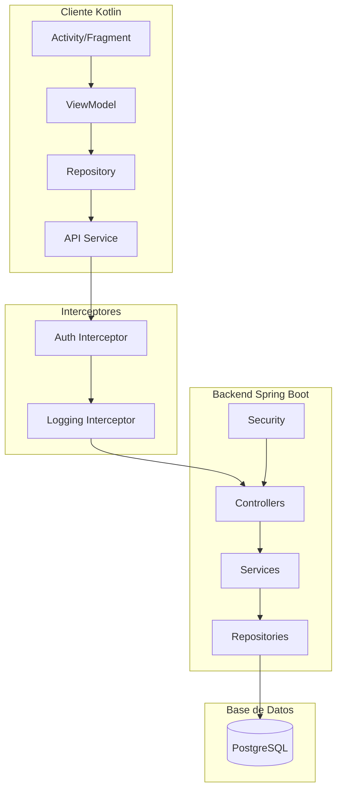
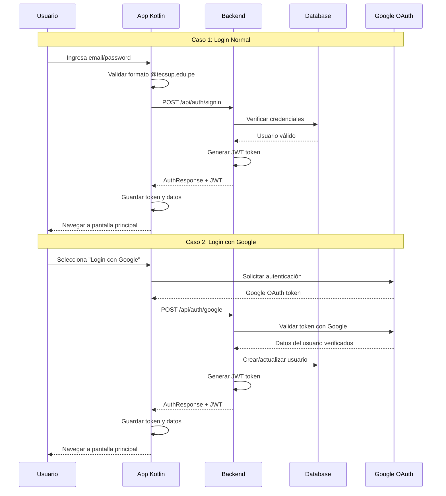
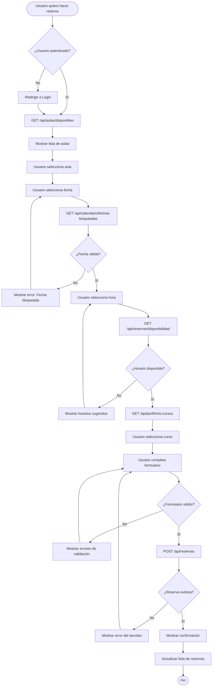
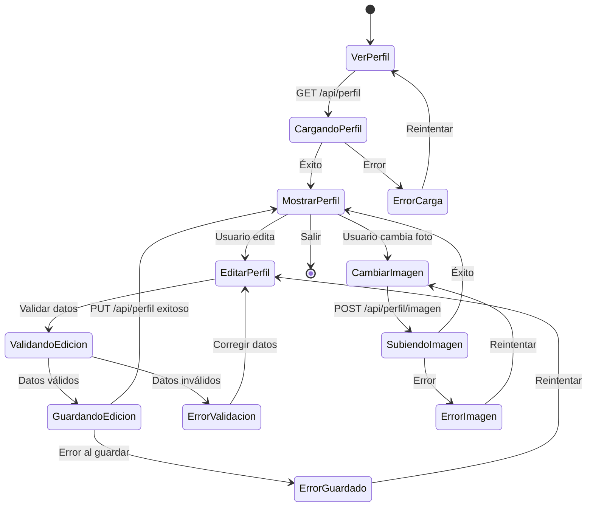
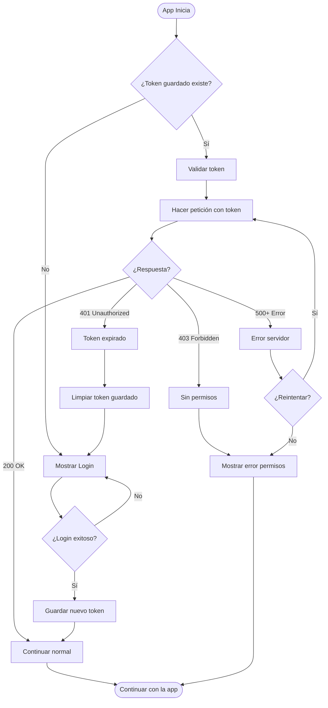
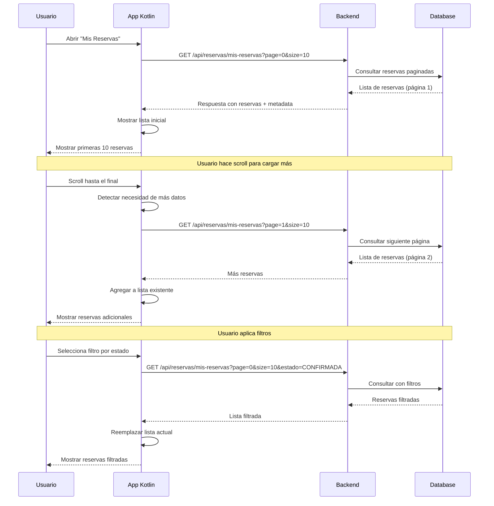
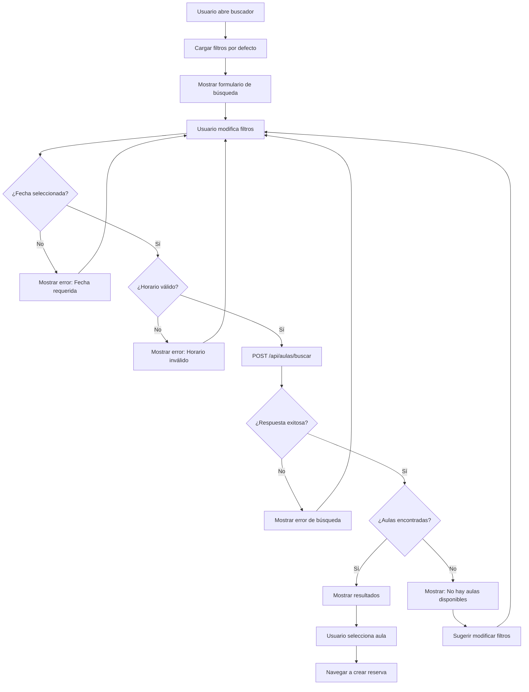
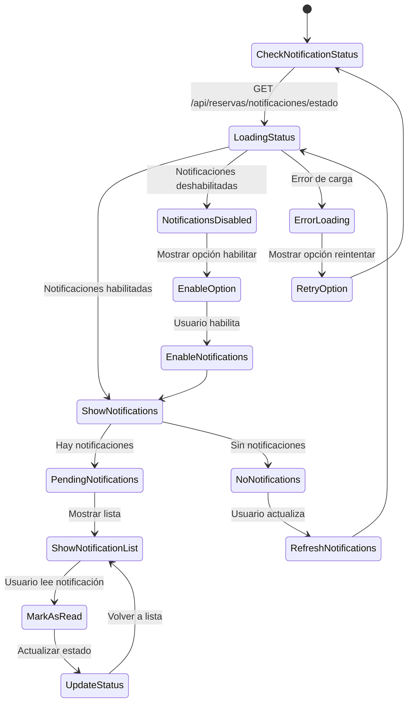
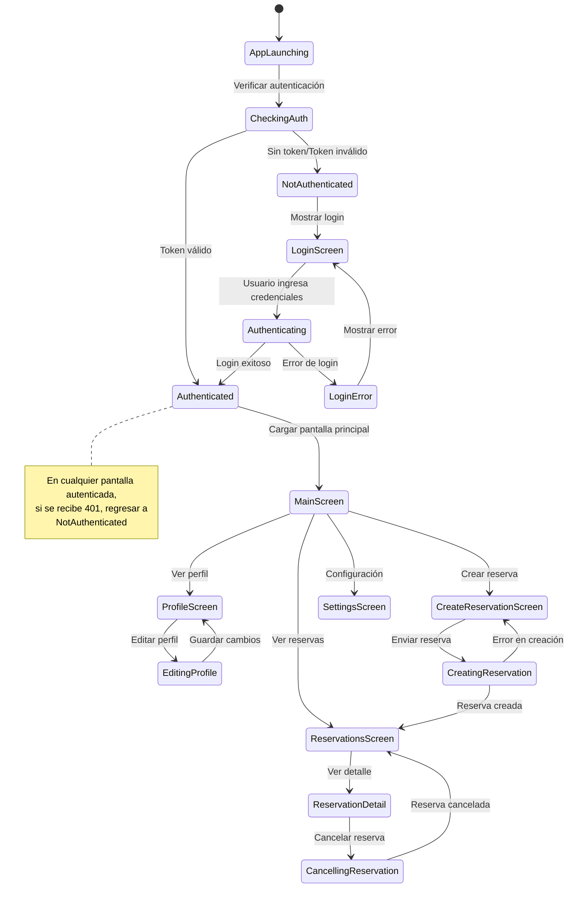

# 📊 Diagramas de Flujo - Sistema de Reservas

## 🏗️ Arquitectura General del Sistema



## 🔐 Flujo de Autenticación Completo



## 📅 Flujo Completo de Creación de Reserva



## 👤 Flujo de Gestión de Perfil



## 🔄 Flujo de Manejo de Tokens JWT



## 📋 Flujo de Lista de Reservas con Paginación



## ❌ Flujo de Cancelación de Reserva

```mermaid
flowchart TD
    Start([Usuario selecciona reserva]) --> CheckStatus{¿Reserva cancelable?}
    CheckStatus -->|No| ShowNotCancelable[Mostrar: No se puede cancelar]
    CheckStatus -->|Sí| ShowConfirmDialog[Mostrar diálogo de confirmación]
    
    ShowConfirmDialog --> UserChoice{¿Usuario confirma?}
    UserChoice -->|No| Cancel[Cancelar acción]
    UserChoice -->|Sí| ShowReasonDialog[Mostrar diálogo para motivo]
    
    ShowReasonDialog --> ValidateReason{¿Motivo válido?}
    ValidateReason -->|No| ShowReasonError[Mostrar error: Motivo requerido]
    ValidateReason -->|Sí| SubmitCancellation[DELETE /api/reservas/{id}/cancelar]
    
    SubmitCancellation --> ProcessResponse{¿Éxito?}
    ProcessResponse -->|No| ShowCancelError[Mostrar error de cancelación]
    ProcessResponse -->|Sí| ShowCancelSuccess[Mostrar confirmación]
    
    ShowCancelSuccess --> UpdateLocalList[Actualizar lista local]
    UpdateLocalList --> NotifyUser[Notificar cambio de estado]
    NotifyUser --> End([Fin])
    
    ShowNotCancelable --> End
    Cancel --> End
    ShowReasonError --> ShowReasonDialog
    ShowCancelError --> End
```

## 🔍 Flujo de Búsqueda de Aulas con Filtros



## 🔔 Flujo de Notificaciones



## 📊 Manejo de Estados de la App



Estos diagramas proporcionan una guía visual completa para entender todos los flujos principales del sistema y facilitarán la implementación en la aplicación Kotlin.
